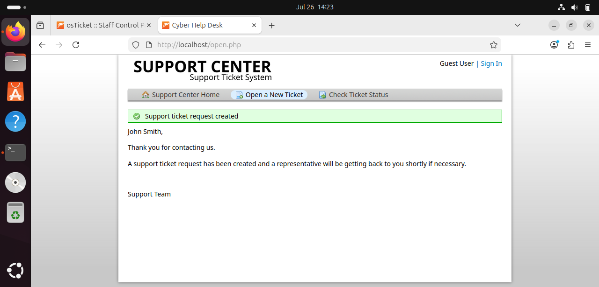
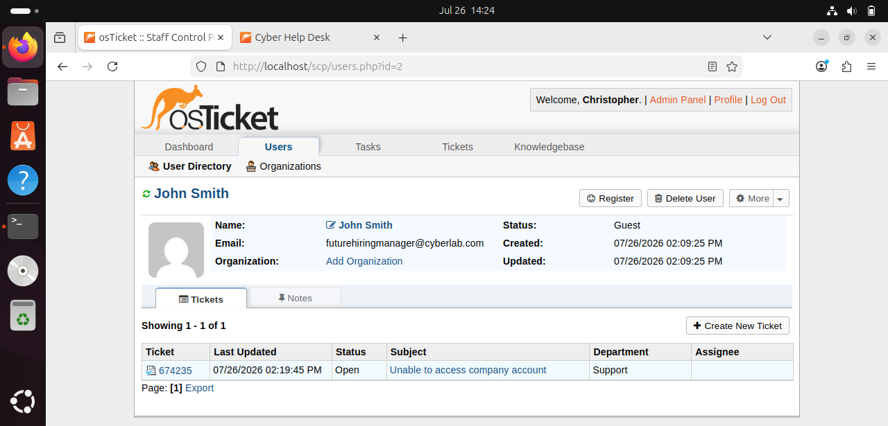
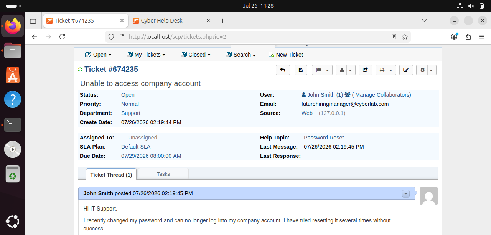
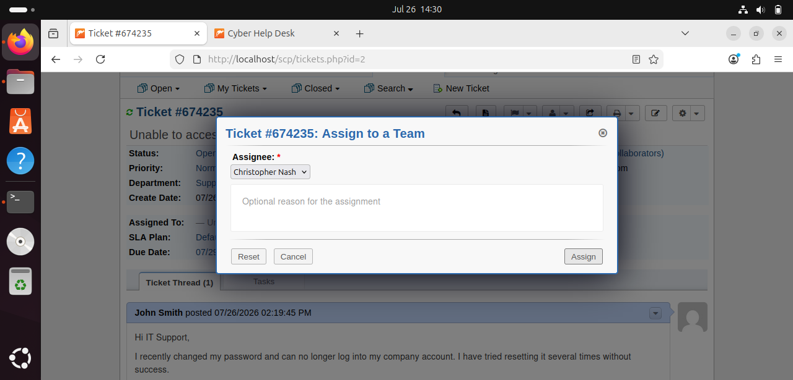
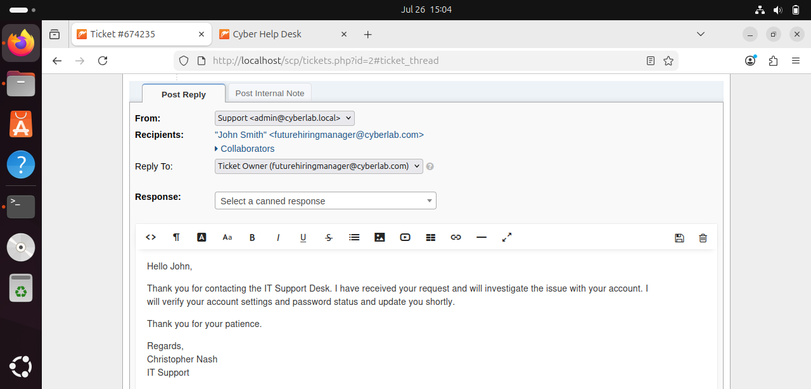
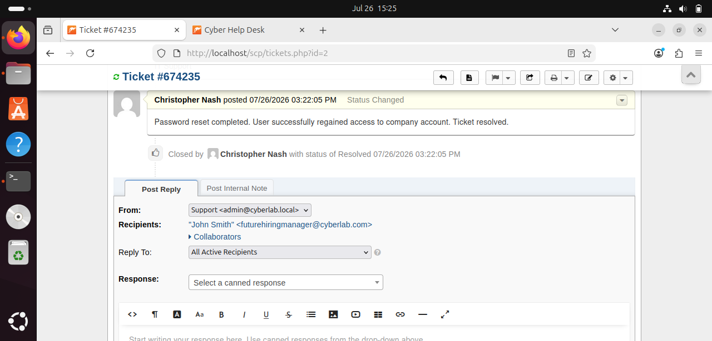

# osTicket Help Desk Lab

## Project Overview
This project demonstrates the deployment and use of osTicket, an open-source help desk ticketing system, on Ubuntu Linux. The lab simulates a real-world IT support workflow from ticket creation through resolution.

## Technologies Used
- Ubuntu Linux
- Apache2
- PHP
- MariaDB/MySQL
- osTicket
- Oracle VirtualBox

## Skills Demonstrated
- Linux Administration
- Help Desk Operations
- Ticket Lifecycle Management
- User Account Management
- Customer Support
- Password Reset Procedures
- Technical Documentation

## Ticket Workflow

1. User submits a support ticket.
2. Ticket appears in the agent dashboard.
3. Ticket is assigned to a technician.
4. Technician investigates the issue.
5. Response is posted to the user.
6. Password reset is completed.
7. Ticket is resolved.

## Screenshots

- Support Ticket Created
- User Ticket Listed
- Ticket Opened
- Ticket Assigned
- Reply Posted
- Ticket Resolved

## Outcome
## Screenshots

### 1. Support Ticket Created

### 2. User Ticket Listed

### 3. Ticket Opened

### 4. Ticket Assigned

### 5. Reply Posted

### 6. Ticket Resolved and Closed

Successfully configured osTicket and completed an end-to-end help desk support workflow, demonstrating practical IT support and ticket management skills.
